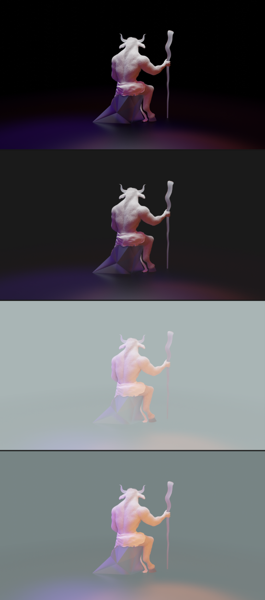
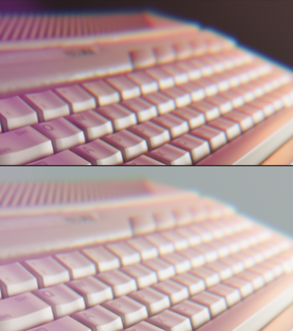

# ManticMinotaurWallpapers

My submissions for the Ubuntu 23.10 (Mantic Minotaur) wallpaper competition.

---

>Images are released under CC BY-SA 4.0.
>
>Images were made using Blender and Krita.

---

>["Atari 65XE computer set"](https://skfb.ly/ouAZ7) by Museum of Engineering and Technology, Krakow is licensed under [CC Attribution-NonCommercial-ShareAlike](http://creativecommons.org/licenses/by-nc-sa/4.0/).

>["Asus Z170-P Motherboard"](https://skfb.ly/oqYwJ) by Lassi Kaukonen is licensed under [Creative Commons Attribution](http://creativecommons.org/licenses/by/4.0/).

---

## Previews

### Mantic Minotaur

### Waves

### Horns

### Hardware

---
